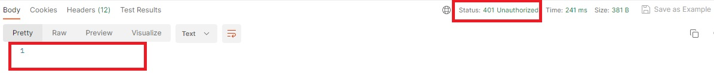
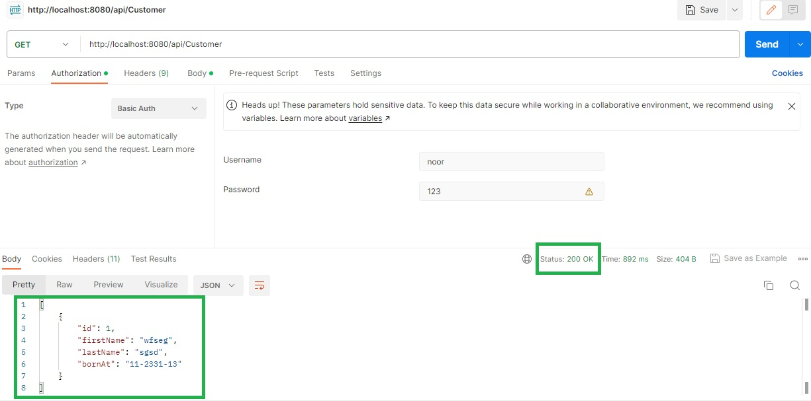

# Model and Sql

### I did the protection by adding two classes


### The Tree of Project

```markdown
- __API__
  - __Model__
    - [Account.class]
    - [Customer.class]
    - [Order.class]
    - [Product.class]
    - [ProductOrder.class]
    - [Role.class]
    - [Stock.class]
  - __init__
    - [ApplicationStartRunner.class]
  - __repository__
    - [AccountRepository.interface]
    - [JpaCustomerRepository.interface]
    - [JpaOrderRepository.interface]
    - [JpaProductOrderRepository.interface]
    - [JpaProductRepository.interface]
    - [JpaStockRepository.interface]
    - [RoleRepository.interface]
  - __resource__
    - [AccountResource.class]
    - [CustomerResource.class]
    - [OrderResource.class]
    - [ProductOrderResource.class]
    - [ProductResource.class]
    - [StockResource.class]
  - __security__
    - [AccountAuthenticationProvider.class]
    - [SecurityConfiguration.class]
    - [WebSecurityConfiguration.class]
  - __service__
    - __impl__
        - [AccountServiceImpl.class]
        - [JpaCustomerServiceImpl.class]
        - [JpaOrderServiceImpl.class]
        - [JpaProductOrderServiceImpl.class]
        - [JpaProductServiceImpl.class]
        - [JpaStockServiceImpl.class]
        - [UserDetailsServiceImpl.class]
    - [AccountService.interface]
    - [CustomerService.interface]
    - [OrderService.interface]
    - [ProductOrderService.interface]
    - [ProductService.interface]
    - [StockService.interface]
  
```

### If you do not add a username and password, you will not be able to access

##### Here the registration is not done


##### Here it is registered

